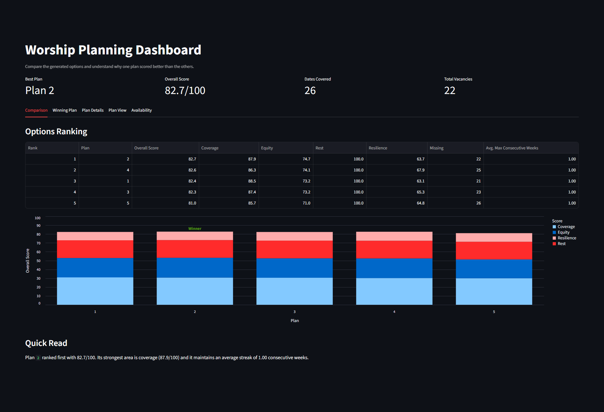
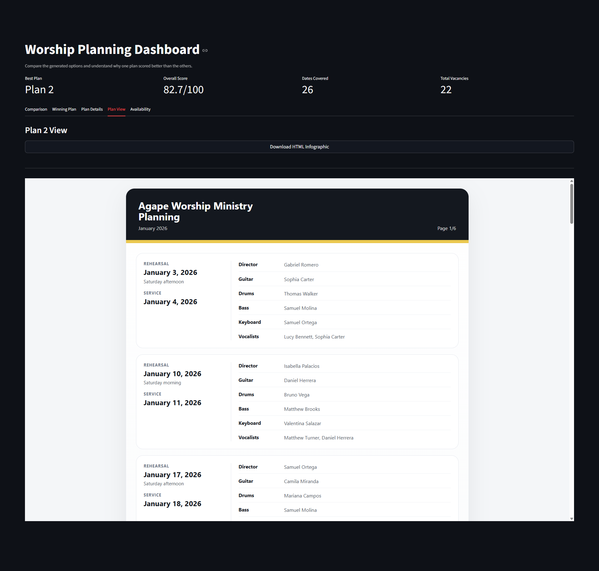
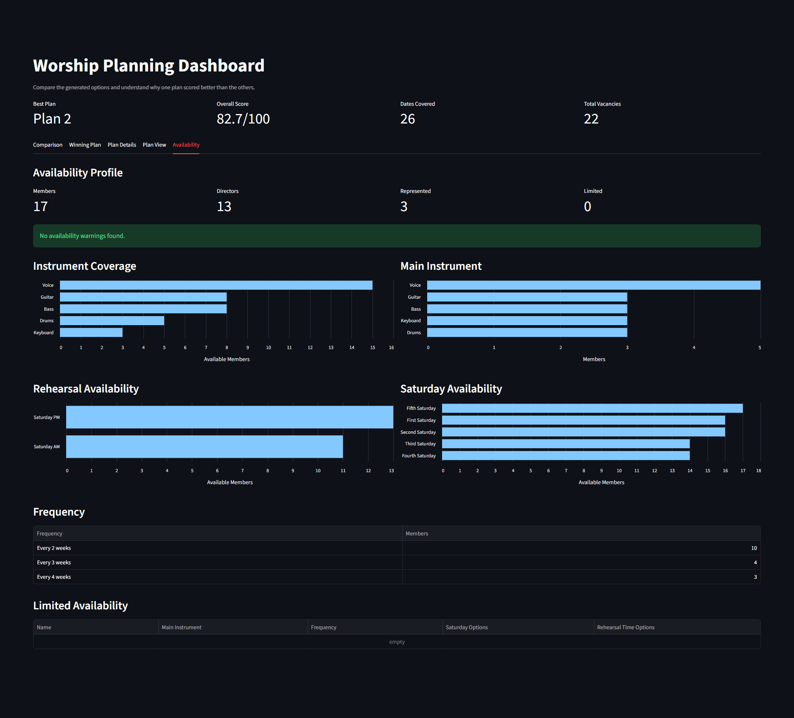

# Worship Planning

Data pipeline and Streamlit dashboard for planning worship band schedules.

## Overview

Planning a worship band manually can become difficult as the team grows. It is easy to overuse the same musicians, miss availability constraints, lose visibility into participation history, and spend too much time comparing schedule options.

This project turns worship availability spreadsheets into cleaned data, generated planning options, plan evaluation metrics, and dashboard views that make the scheduling process easier to review.

## App Preview

### Plan Comparison



### Monthly Plan View



### Availability Profile



## Current Features

- Loads worship availability from Excel.
- Cleans and standardizes names, roles, dates, instruments, and availability fields.
- Generates multiple planning options.
- Scores plans using coverage, equity, rest, and resilience metrics.
- Exports a lightweight monthly HTML plan view.
- Provides a Streamlit dashboard to compare generated plans, inspect plan details, preview the monthly plan view, and review availability.

## Tech Stack

- Python
- pandas
- NumPy
- Altair
- OpenPyXL
- Streamlit

## Project Structure

```text
Worship_planning/
|-- app/
|   `-- streamlit_app.py
|-- data/
|   |-- raw/
|   |   `-- worship_availability_demo_en.xlsx
|   |-- interim/
|   `-- processed/
|-- docs/
|   `-- images/
|-- outputs/
|-- src/
|   |-- data/
|   |   |-- clean_data.py
|   |   |-- load_data.py
|   |   `-- save_data.py
|   |-- pipeline/
|   |   `-- run_pipeline.py
|   |-- planning/
|   |   |-- filters.py
|   |   |-- plan_generation.py
|   |   `-- schema.py
|   `-- reporting/
|       |-- dashboard_view.py
|       |-- evaluation_metrics.py
|       |-- export_infographic.py
|       `-- plan_evaluation.py
|-- .gitignore
|-- README.md
`-- requirements.txt
```

## Data Policy

The repository is organized around lowercase directory names.

- `data/raw/worship_availability_demo_en.xlsx` is the default demo input file.
- `data/raw/worship_availability.xlsx` is treated as local/private data and ignored by Git.
- `data/interim/`, `data/processed/`, and `outputs/` contain generated artifacts that can be refreshed by the pipeline.
- `notebooks/` is currently treated as local exploratory work and ignored by Git.

## Setup

Create and activate a virtual environment, then install the project dependencies:

```bash
pip install -r requirements.txt
```

## Run the Pipeline

Generate cleaned data, planning options, evaluation scores, and the HTML infographic:

```bash
python -m src.pipeline.run_pipeline --start-date 2026-01-04
```

If `--start-date` is omitted, the pipeline uses its default Sunday start date.
The start date must be a Sunday service date.
Use `--raw-path` to run the pipeline against another availability workbook.

The pipeline reads from:

```text
data/raw/worship_availability_demo_en.xlsx
```

and writes generated outputs under:

```text
data/interim/
data/processed/
outputs/
```

## Run the Dashboard

After running the pipeline, launch the dashboard:

```bash
python -m streamlit run app/streamlit_app.py
```

The dashboard lets you compare generated plans, inspect the winning plan, review weekly assignments, preview and download the monthly HTML plan view, and understand the score breakdown.

## Notes

The reusable project logic lives under `src/`. New scheduling, scoring, or reporting behavior should generally be added there first, then used from the pipeline or the Streamlit app.
